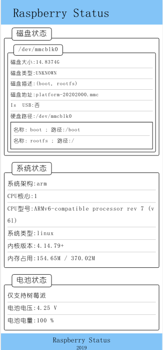
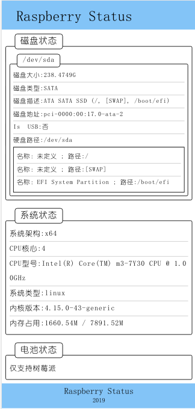

# 树莓派 zero 状态检测

&nbsp;&nbsp;&nbsp;&nbsp;此项目是为了`树莓派 zero` 开发，用于查看树莓派状态，主要为 电池状态，实现低电量自动关机

## 使用说明

    npm install
    # 初次使用时候可以设置帐号密码
    npm start username=username password=password
    
## 运行界面

> 
    
## 邮件通知 （需要自己搭建）

> 

## 其他

桌面 `ubuntu` 也能够跑起来

> 

## 关于 `zero` 电池

> 
> 